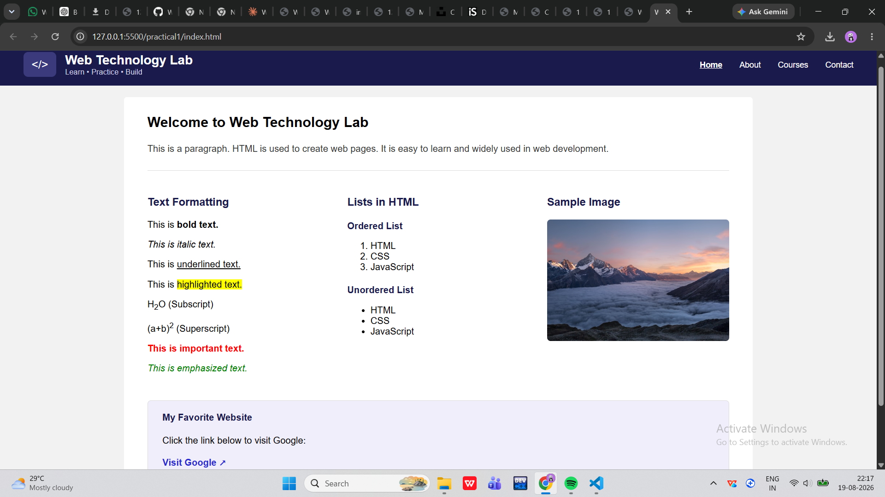

# Web Technology Lab

This is a simple webpage I made to practice basic HTML and CSS.

## What this project has

- A navbar with logo and menu links (Home, About, Courses, Contact)
- A welcome section with a heading and paragraph
- Text formatting examples (bold, italic, underline, highlight, subscript, superscript, important text, emphasized text)
- Ordered list and unordered list example
- A sample image
- A small box with a link to Google
- Footer with copyright text

## Files

- `index.html` - contains all the HTML and CSS (CSS is written inside the `<style>` tag in the head section)

## How to run it

1. Download the `index.html` file
2. Double click it, or open it in any browser (Chrome, Firefox, etc.)
3. That's it, no installation needed

## What I learned / practiced

- Using flexbox for the navbar and the 3 column layout
- Text tags like `<b>`, `<i>`, `<u>`, `<mark>`, ``, ``
- Ordered `<ol>` and unordered `<ul>` lists
- Styling with basic CSS (colors, padding, border-radius)
- Adding an image and an external link

## Output Screenshot

## Note

The image used is just a sample image from the internet, you can replace it with your own image by changing the `src` in the `` tag.
Also make sure `screenshot.png` is placed in the same folder as this README, otherwise the image won't show.