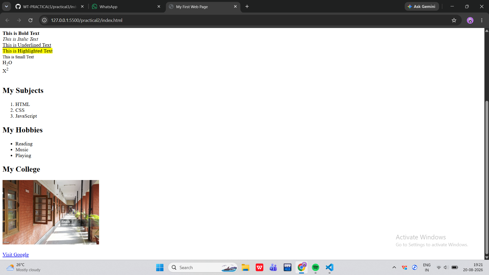
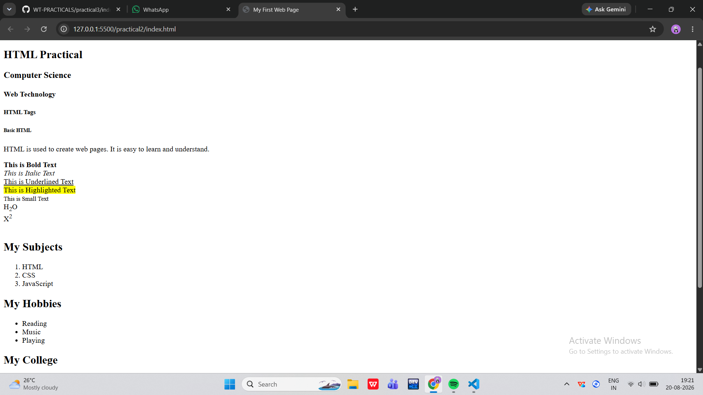

Practical 2

Aim

To create a webpage using HTML and CSS.

Objective

The objective of this practical is to understand the basic structure of an HTML webpage and apply CSS to make the webpage simple and attractive.

Technologies Used

- HTML
- CSS
- VS Code
- Web Browser

Files Used

File| Description
"index.html"| Contains the HTML code
"style.css"| Contains the CSS styling
"output.png"| Screenshot of the final output

HTML

The "index.html" file contains the basic structure of the webpage and the required HTML elements.

CSS

The "style.css" file is used to add styling such as colors, spacing, fonts, borders and alignment to the webpage.

Output

The final output of Practical 2 is shown below.

Result

The webpage was successfully created using HTML and CSS, and the required output was obtained.