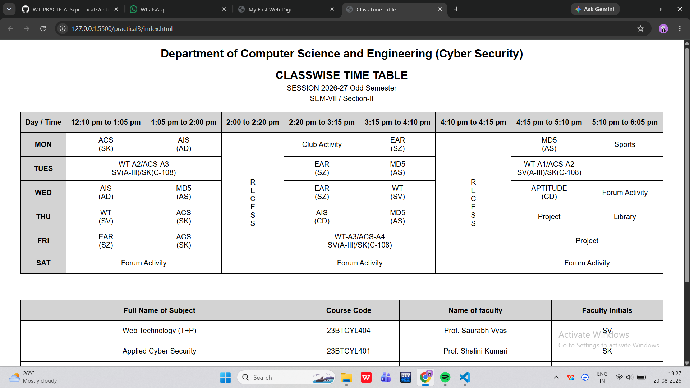
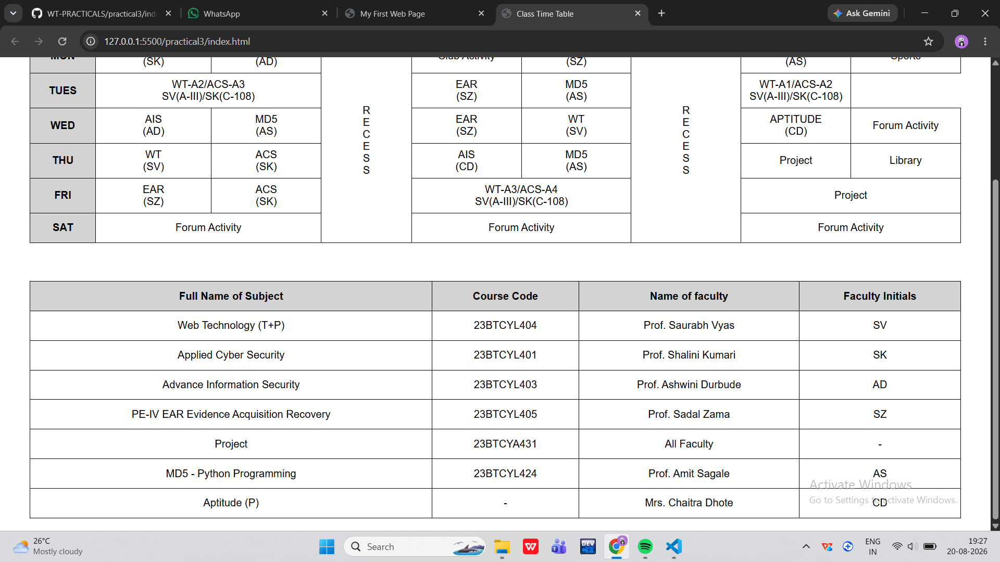

Practical 3

Aim

To create a table using HTML.

Objective

The objective of this practical is to understand how to create and design tables using HTML.

Technologies Used

- HTML
- CSS
- VS Code
- Web Browser

Files Used

File| Description
"index.html"| Contains the HTML code for the table
"style.css"| Contains the CSS styling
"output.png"| Screenshot of the final output

Concepts Used

- HTML Table
- Table Rows
- Table Headings
- Table Data
- CSS Styling
- Borders
- Alignment

Output

The final output of Practical 3 is shown below.

Result

The table was successfully created using HTML and CSS, and the required output was obtained.