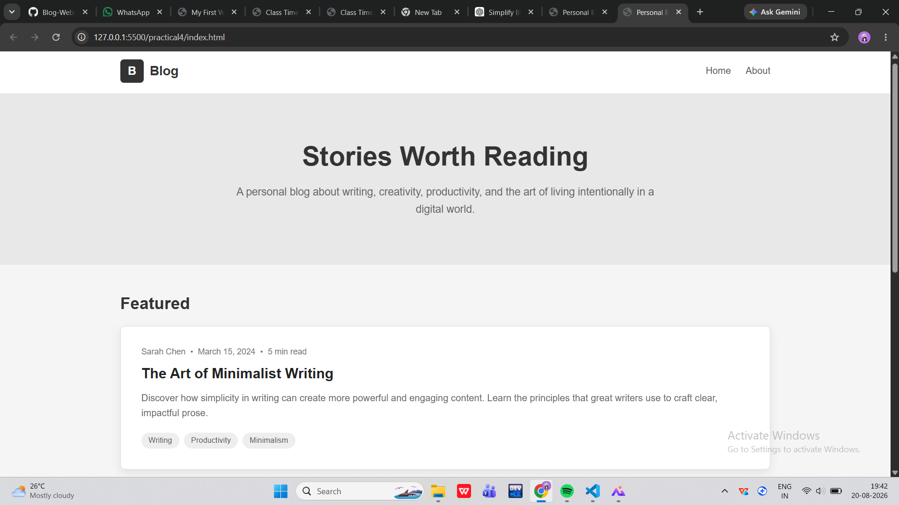
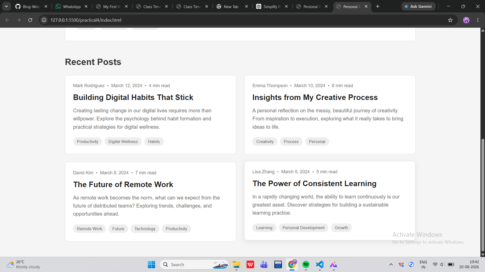

# Practical 4

## Aim

To create a personal blog webpage using HTML and CSS.

## Objective

The objective of this practical is to understand how to create and design a simple blog webpage using HTML and CSS.

## Technologies Used

- HTML
- CSS
- VS Code
- Web Browser

## Files Used

| File | Description |
|---|---|
| `index.html` | Contains the HTML code for the blog webpage |
| `styles.css` | Contains the CSS styling for the webpage |
| `output.png` | Screenshot of the final output |

## Concepts Used

- HTML Structure
- Header
- Navigation Bar
- Hero Section
- Blog Cards
- Featured Post
- Recent Posts
- HTML Tags
- CSS Styling
- CSS Flexbox
- CSS Grid
- Borders
- Spacing
- Responsive Design

## Output

The final output of Practical 4 is shown below.

## Result

The personal blog webpage was successfully created using HTML and CSS, and the required output was obtained.